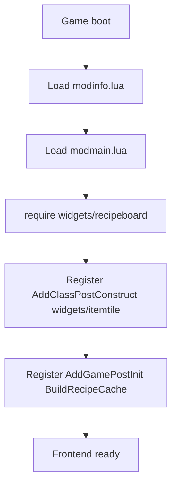
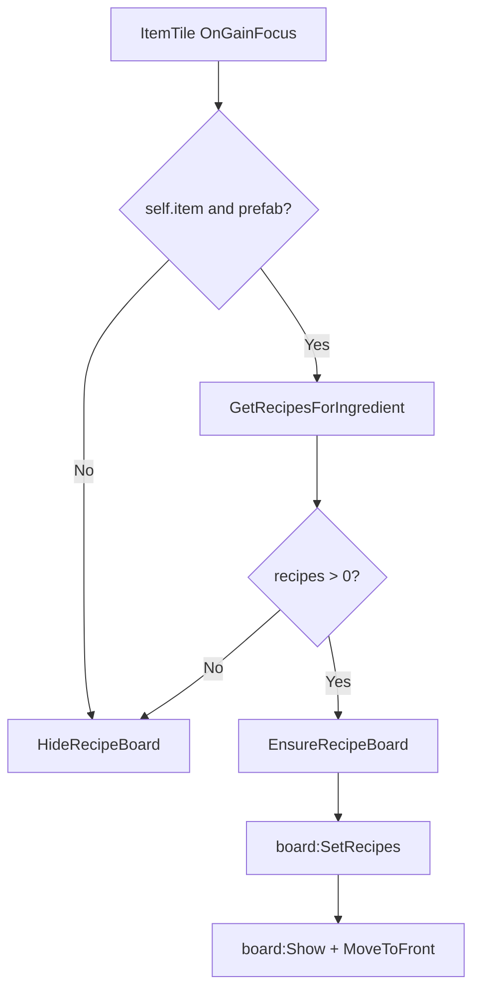
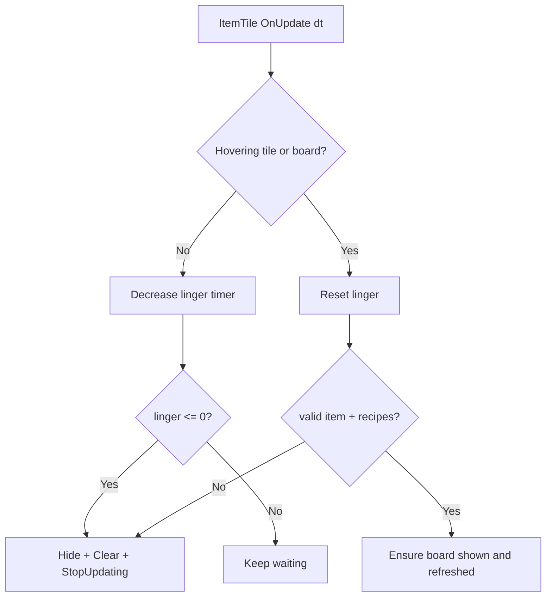
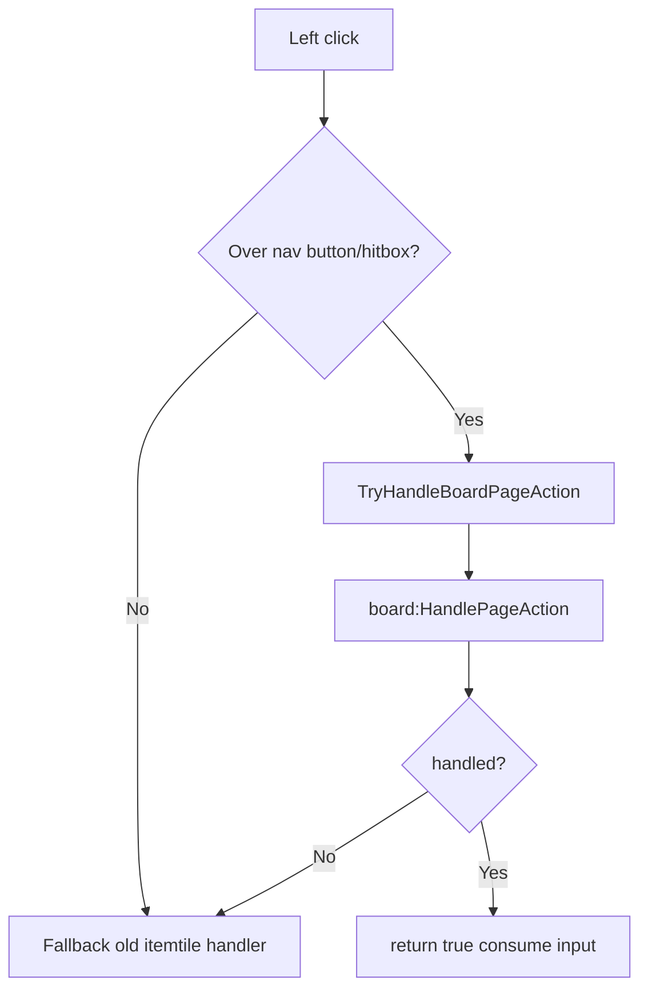
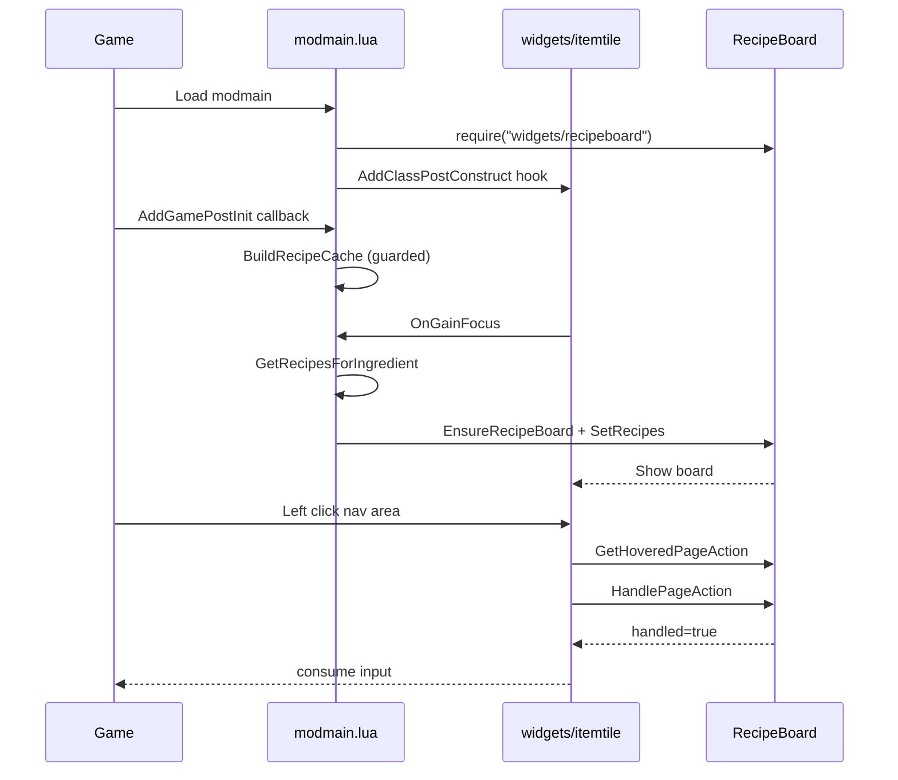
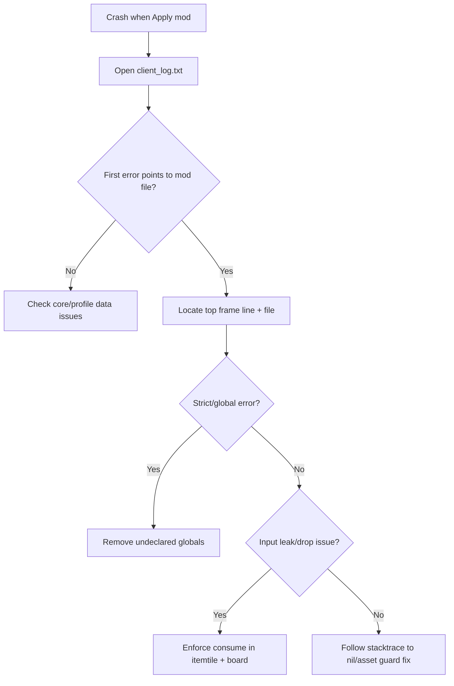

# 03. Runtime Flow (Mermaid v11.13.0)

## 1. Startup flow

## 2. Hover-to-render flow

## 3. Update + grace timer flow

## 4. Pagination input routing flow

## 5. Startup + runtime sequence

## 6. First-fault troubleshooting flow

